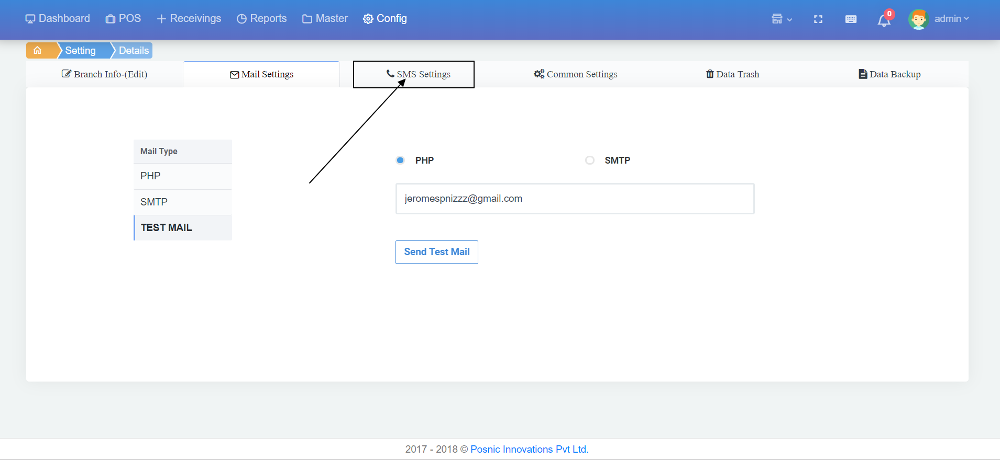
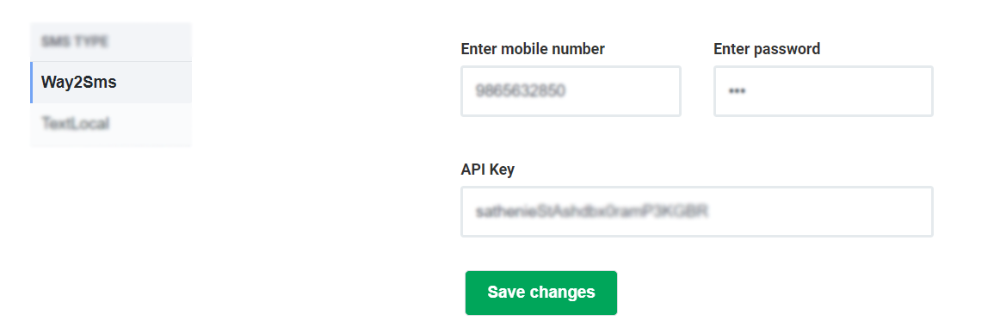
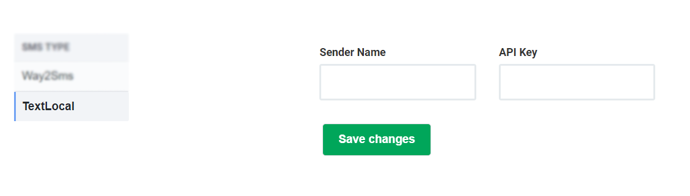

# 3.SMS Settings

SMS Setting செல்ல SMS Setting ஐ கிளிக் செய்யவும்.

sms setting இல் இரண்டு வழிமுறைகள் உள்ளது 1.way2sms 2.textlocal

**1.way2sms** way2sms முறையில் நீங்கள் way2sms account ஐ இதில் add செய்துகொள்ளமுடியும் இதன் மூலமாக customer வாங்கும் பொருட்களுக்கான bill ஐ message மூலமாக அவர்களின் mobile நம்பருக்கு sms ஆக அனுப்ப முடியும்.

2.textlocal textlocal முறையில் உங்களின் மொபைல் எண்னை நேரடியா config செய்து அதன் மூலமாக customer வாங்கும் பொருட்களுக்கான bill ஐ message மூலமாக அவர்களின் mobile நம்பருக்கு sms ஆக அனுப்ப முடியும்.

