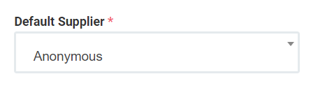
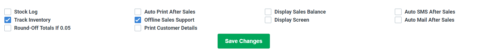

# 4.common settings

common settings இல் நீங்கள் default customer default supplier, உங்களின் bill number கு முன்பு எப்படி துவங்க வேண்டும், என்பது போன்ற பலவிதமான அம்சங்கள் உள்ளது அதை இப்பகுதியில் விரிவாக காணலாம்....

default customer என்பது நாம் shop வாடிக்கையாளர் தவிர walking customers அதிகமாக இருந்தால் நாம் ஒவ்வொரு முறையும் பில் பகுதில் customer details சேர்க்கும் சிரமம் இதனால் தவிர்க்கப்படும்.இதில் customer add ஏப்படி செய்யவேண்டும் என்பதை இந்த லிங்க் இல் காணவும்..Default customer

default customer இந்த பயன்படானது நாம் பொருட்களை purchase செய்யும்போது விரைவாக அந்த பொருளை sales item ஆக சேர்க்க செய்கிறது எந்த முறையில் default customer add செய்ய வேண்டும் என்பதை இந்த லிங்க் ல் விரிவாக பார்க்கலாம் [default customer](master/1.customer-details.md)

Receiving prefix இதன் பயன்பாடு நாம் நம் shop ற்கு பொருட்கள் purchase செய்யும்போது purchase செய்ததற்கான பில் என்ட்ரி செய்ய அந்த பில் இன் நம்பர் முன்பு என்ன வர வேண்டும் என்று நாமே வைத்துக்கொள்ளலா முடியும் இங்கு RID என்று உள்ளது நீங்கள் உங்கள் விருப்பம் போல மாற்றிக்கொள்ளலாம் .

Sales prefix இதுவும் Receiving prefix போன்றுதான் ஆனால் நம் விற்பனை செய்யும் பொருளுக்கு கொடுக்கும் bill number முன்பு என்ன வரவேண்டும் என்று கொடுக்க உதவிடும் பகுதி இது

Discount இந்த பகுதி இல் நம் ஷாப் இல் விற்கப்படும் பொருட்களுக்கு கொடுக்கும் பில் இல் default & flat Discount க்கு உதவிடும் வகையில் இது அமைக்கப்பட்டு உள்ளது இதில் கொடுக்கப்படும் discount % அணைத்து பில்லிலும் தானாகவே discount செய்திடும். discount ஏதும் இல்லை என்றால் 0 இல் வைக்கலாம் .

Items Store Access In Offline ,Customer Store Access In Offline இதன் பெயரிலேயே அதன் பயன்பாடுகளை தெரிவித்து இருக்கிறது ஆம் net இல்லாத நேரமும் pos பில்லிங் இயங்க வழிவகை செய்ய பயன்படுகிறது வேண்டும் என்றால் நாமே நமக்கான தெரிவை செல்சக்ட் செய்துகொள்ளலாம்

![Call Back Time Set \[Minutes\]](.gitbook/assets/call-back-time-set-minutes.png)

indain GST நமக்கு GST ஒரு பொருளுக்கு இருந்தால் enable செய்துகொள்ளலாம் வேண்டாம் என்றால் disable செய்துகொள்ளலாம் உலகளாவிய பயன்பாட்டிற்கும் இந்தியர்கள் பயன்பாட்டிற்கும் ஏற்றவகையில் இது அமைக்கப்பட்டது இப்போது மேலே நாம் enable செய்தால் என்ன நடக்கிறது என கிழ் உள்ள picture ஐ பாருங்கள்

enable செய்ததால் நமக்கு 28% GST தானாக CGST 9% ம் SGST 9% ம் IGS 18% ஆக கொடுக்கிறது. இது நாம் கொடுக்கும் ஒவ்வொரு பில் receipt லும் apply ஆகும்.

Tax & Tax Description இந்த பகுதி நம் bill receipt இல் default ஆக tax amount நிரப்ப வழிவகை செய்கிறது இதில் கொடுக்கப்படும் tax ஆனது அனைத்து bill receipt லும் apply ஆகும் Tax Description நம் tax ஏதற்காக என்பதை சிறு குறிப்பின் வழியாக தெரிவிக்க உதவுகிறது.

இங்கு இருக்கும் பகுதி நமக்கு மேலும் சில மேம்பட்ட சில futures களை கொடுக்கிறது. அதில் இருக்கும் box ஐ click செய்வதன் மூலமாக enable செய்ய இயலும்.

1. Stock Log நம் ஷாப்பில் உள்ள பொருட்களின் இருப்புகளை தெரிவிக்க உதவுகிறது
2. Track Inventory
3. Round-Off Totals If 0.05

   இதன் பயன்பாடு நாம் கொடுக்கும் பில் இல் 69.50rs என இருந்தால் தானாகவே அந்த தொகையினை  round off செய்து 70.00rs ஆக மற்றி கொடுக்கும் அமைப்பு இது 

4. Auto Print After Sales இதன் பயன்பாடு நாம் sales முடித்து பில் போடும்பொழுது இந்த அமைப்பு on இல் இருந்தால் sales பில் save ஆனபின் தானாகவே print screen க்கு செல்லும்.
5. Offline Sales Support. நெட் இல்லாத சமயத்திலும் இந்த பயன்பாட்டினால் நாம் முழுவதுமாக உபயோகம் செய்திட வழிவகை செய்கிறது
6. Print Customer Detailsபில் print இல் customer details உடன் பிரிண்ட் வேண்டும் என்றால் இந்த option ஐ பயன்படுத்தலாம் .
7. Display Sales Balance இந்த option வாடிக்கையாளர் bill தொகையை கொடுக்கும் பொழுது அவர் கொடுக்கும் தொகைக்கு மீதம் எவ்வளவும் நாம் கொடுக்கவேண்டும் என்பதை சுலபமாக காமிக்க பயன்படுகிறது
8. Display Screen உங்கள் computer screen இல் keyboard \(onscreen keyboard \) ஐ use செய்ய இந்த option பயன்படுகிறது.
9. Auto SMS After Sales இந்த option சேல்ஸ் பில் ஐ SMS அனுப்ப உதவிடும்.
10. Auto Mail After Sales இந்த option சேல்ஸ் பில் ஐ Mail அனுப்ப உதவிடும்.

common setting இல் நமக்கு தேவையானவற்றை செய்து கடைசியாக save changes click செய்து save செய்யவேண்டும்

