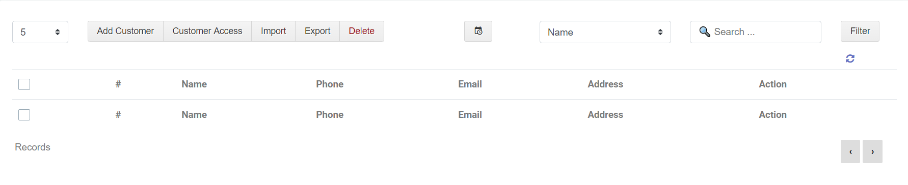

# 1.Customer details

customer details ல் நமது வாடிக்கையாளர்களின் முழுமையான விவரங்களை சேமித்து வைத்துக்கொள்ள முடியும். இதில்

1. add customer 
2. Customer Access 
3. Import 
4. Export 
5. Delete

போன்ற option உள்ளது மேலும் ஒரு customer விவரங்களை விரைவாக கண்டுபிடிக்க fillers கொடுக்கப்பட்டு உள்ளது.

1. Date 
2. filler 
3. Name 
4. Phone 
5. Email 
6. Address

Filers கொடுக்கப்பட்டு உள்ளது இதனை கொண்டு நாம் Save செய்த ஒரு customer details ஐ விரைவாக தேடி எடுக்க முடியும்

