# 1.Customer details

customer details ல் நமது வாடிக்கையாளர்களின் முழுமையான விவரங்களை சேமித்து வைத்துக்கொள்ள முடியும். இதில்

1. add customer 
2. Customer Access 
3. Import 
4. Export 
5. Delete

போன்ற option உள்ளது மேலும் ஒரு customer விவரங்களை விரைவாக கண்டுபிடிக்க fillers கொடுக்கப்பட்டு உள்ளது.

1. Date 
2. filler 
3. Name 
4. Phone 
5. Email 
6. Address

Filers கொடுக்கப்பட்டு உள்ளது இதனை கொண்டு நாம் Save செய்த ஒரு customer details ஐ விரைவாக தேடி எடுக்க முடியும்

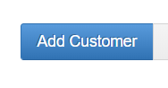

ஒரு Customer ஐ Add செய்ய add customer ஐ கிளிக் செய்யவேண்டும்.

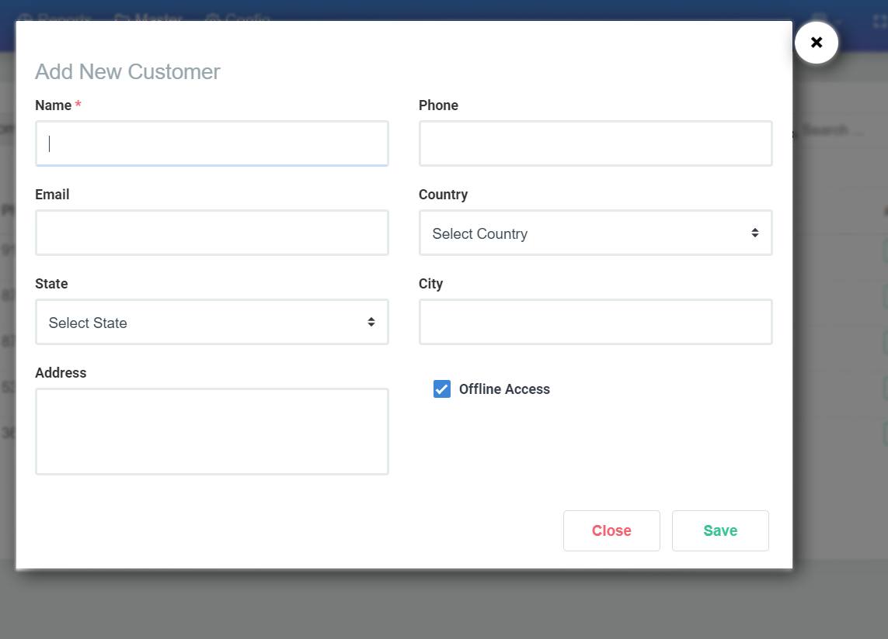

add customer ஐ கிளிக் செய்தவுடன் மேல இருக்கும் screen Add New Customer Screen இதில் Customer Name ஐ முதலில் கொடுக்கவேண்டும் 

* .Customer Email ID 
* Phone
* Country
* State
* City
* Address 

ஆகியவற்றை கொடுக்கவும். அந்த customer உங்களுக்கு offline access ல் இருக்க விரும்பினால் offline access box ல் click செய்து save செய்துகொள்ளவும்.

save ஆனதை உறுதி செய்ய மேலே உள்ளதுபோன்ற ஒரு success alert ஐ காணலாம். இதுபோல நம்மளுடைய customer ஐ add செய்து கொள்ளலாம்

**இப்போது நாம் add customer ல் உள்ள import என்றால் என்ன என்பதை இங்கே பார்க்கப்போகிக்கிறோம்**.

இப்போது நாம் add customer கு அருகில் இருக்கும் import பட்டன் ஐ click செய்தால் கேழ்க்கண்டவாறு pop up ஒன்று open ஆகிறது

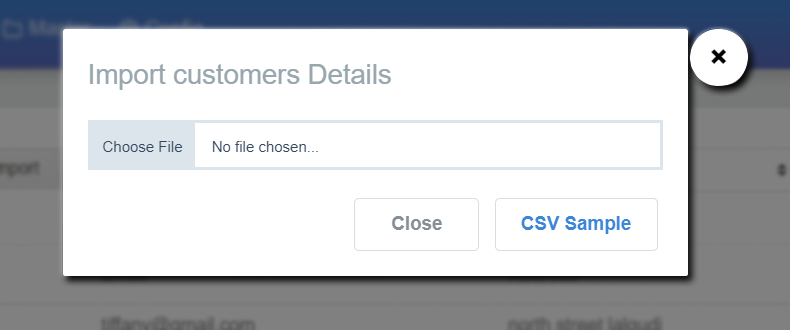

முதலில் தெரியும் திரையில் இருக்கும் sample csv icon ஐ கிளிக் செய்து எங்களின் point of sale customer details format ஐ பார்க்கவும் .

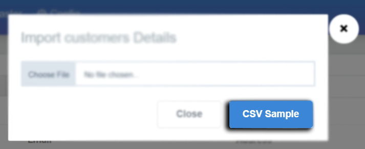

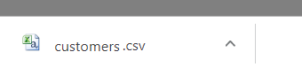

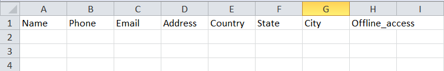

இங்கே எங்களின் csv formet download ஆகும் அதில் உள்ள formet ஐ ஓபன் செய்து பார்த்து இந்த formet உடன் நீங்கள் import செய்யும் customer data format ம் correct ஆக match ஆகவேண்டும் . correct ஆக இருந்தால் import வெற்றிகரமாக முடியும்.

**அடுத்ததாக இருப்பது export option**

export option ல் நம்முடைய customer data வை csv formet ல் download செய்துகொள்ளலாம் . அதற்கு முன்பாக select option ஐ காணலாம்

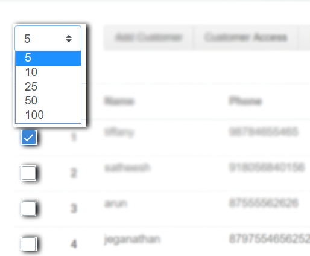

select option கு மேலே உள்ள box ல் ஒரு page க்கு எத்தனை list out ஆகவேண்டும் என நாம் select செய்துகொள்ளலாம் . கீழ் உள்ள select option button ஐ click செய்வதன் மூலம் எந்த customer detail வேண்டும் என நாம் select செய்துகொள்ளலாம் . select செய்து import கொடுத்தால் நமக்கு வேண்டிய தகவல் csv format இல் download ஆகும்.

**Action**

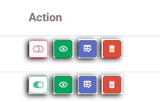

இங்கு Action பயன்பாடுகளை பற்றி பார்க்கப்போகிறோம் action இல் உள்ள icon பயன்பாடுகள் அவற்றால் என்ன என்ன செய்யலாம் என விரிவாக காணலாம்**.**

Action Activate 

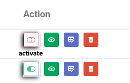

Action என்பது இங்கு customer online & offline access வேண்டும் வேண்டாம் என்பதை ஒரு click இல் செயல்படுத்தலாம் . red குறியானது customer online access வேண்டாம் என select செய்ததை காண பயன்படுகிறது . green குறியானது customer online access வேண்டும் என select செய்ததை காண பயன்படுகிறது.

**View Customer**

view customer action என்பது நாம் ஒரு customer பற்றிய தகவலை இந்த icon ஐ click செய்து பார்க்கலாம்.

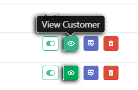

view customer icon ஐ click செய்தல் வரும் pop up உங்கள் பார்வைக்கு

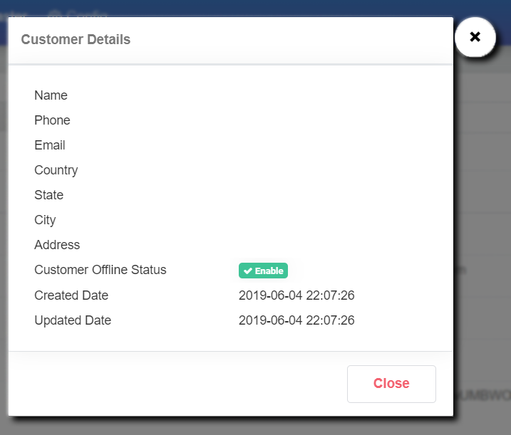

customer details ல் நாம் add செய்த customer name, phone number, போன்ற அவரினுடைய அணைத்து தகவையும் பார்த்துக்கொள்லலாம்.

**Edit Customer**

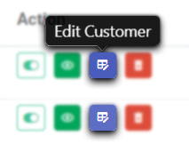

Edit Customer icon பயன் பற்றி இங்கே தெரிந்துகொள்ள போகிறோம்.

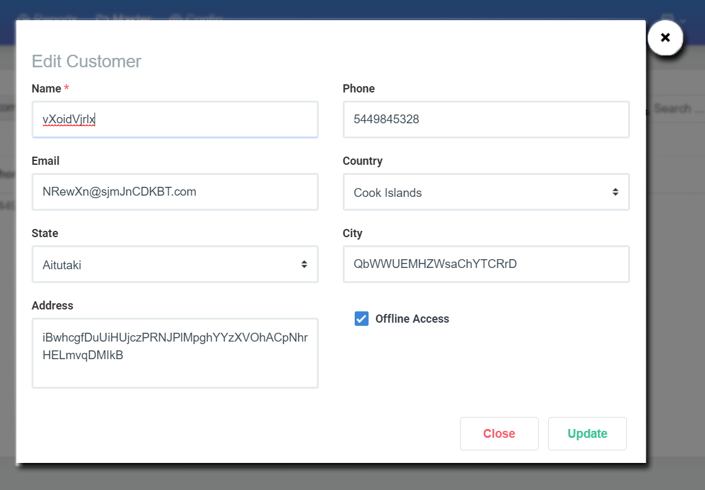

Edit Customer icon ஐ கிளிக் செய்து நாம் கொடுத்த customer details தவறாக இருக்கும் பட்சத்தில் அல்லது customer mobile , name, address போன்ற தகவல்களை edit செய்துகொள்ளும் வசதியை இந்த option அளிக்கிறது.

**Delete Customer**

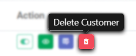

Delete Customer icon ஐ கிளிக் செய்து நாம் கொடுத்த customer details ஐ delete செய்துகொள்ள இந்த icon உதவுகிறது.

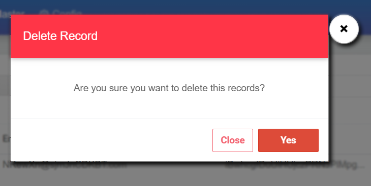

நமக்கு எந்த customer data வேண்டாமோ அதனை select செய்து Delete Customer icon ஐ கிளிக் செய்தவுடன் கொடுத்த customer details ஐ delete செய்துகொள்ளலாமா வேண்டாமா என ஒரு pop up திரையில் தோன்றும் . வேண்டும் என்றால் நாம் yes கொடுத்தால் அந்த customer data delete ஆகிவிடும்.

## **Filters** 

Add customer screen ல் இருக்கும் filters பற்றிய ஒரு தொகுப்பை காணலாம்**.**

1. Date
2. Name
3. phone
4. Address

என 4 வகையான filters இங்கு உள்ளது.

**1.Filter by Date**

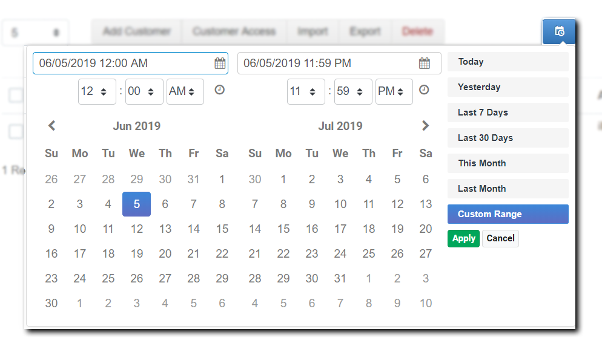

Date filter icon ஐ click செய்வதன் மூலமாக இதனை பெறலாம். இந்த filter ல் இன்று add செய்த customer details நேற்று add செய்த customer details ஒரு வாரமாக add செய்த customer details .போன்ற data வை சுலபமாக தேடிட shortcuts உள்ளது அதி துல்லிய தேடலுக்கு date picker உள்ளது .அதனை பயன்படுத்தியும் விரைவாக தேடலாம்.

**2. Filter by Name, Phone & Address**

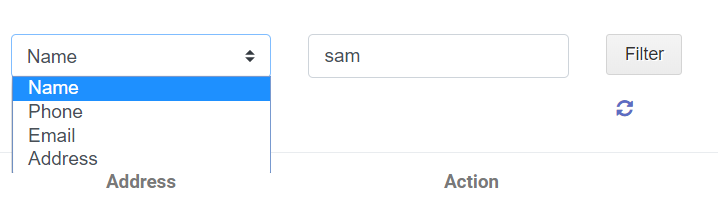

இந்த வகை filter ல் நமக்கு ஒரு customer name தெரியும் என்றால் filter by name select செய்து அவரின் name type செய்து filler icon ஐ click செய்வதன் மூலம் அவருடைய details ஐ நாம் பார்க்கமுடியும் . இதே போலவே filter by phone & filter by address filter தேடல்களும் பயன்படுகிறது.

**Root of Search** 

root of search நாம் எந்த filler உபயோகித்து உள்ளோம் என்பதை நமக்கு அறிவிப்புச்செய்ய பயன்படுகிறது

