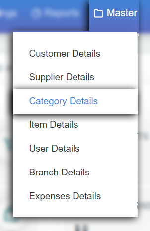
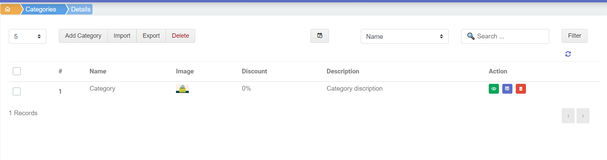
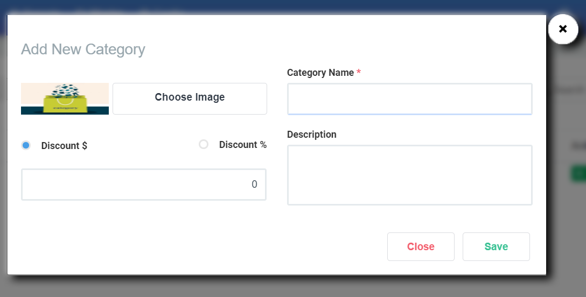

# 3.Category details

நாம் ஒரு பொருளை விற்பனைக்கு purchase செய்யும் பொது அதன் வகை வாரியாக வகைப்படுத்துவோம். அது அந்த விறபனை பொருளை விரைவாக கண்டுபிடிக்க அதன் தரம் அறிய பயன்படும்.

category details add செய்ய master ல் category details ஐ select செய்யவேண்டும்.

category details page ல்

1. Add category
2. Import
3. Export
4. Delete போன்ற option களும்

Fillers & Actions ம் உள்ளது

**1.Add category**

category ஐ Add செய்ய வழக்கமாக நாம் ஏற்கனவே பார்த்தது போலவே Add category button ஐ click செய்யவேண்டும்.

click செய்தவுடன் வரும் popup ல்

அந்த category க்கு image upload செய்து கொள்ளலாம் category name கொடுக்கவேண்டும் அந்த category ஏதேனும் special discount இருந்தால் இங்கே discount பகுதியில் கொடுக்கலாம். அந்த category பற்றிய சிறு குறிப்புகளையும் Description ல் type செய்து save செய்துகொள்ளலாம்.

