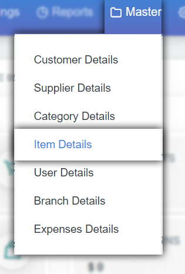
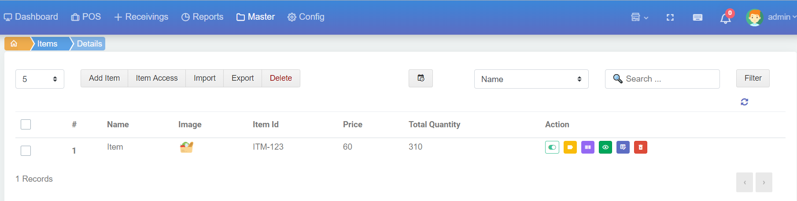
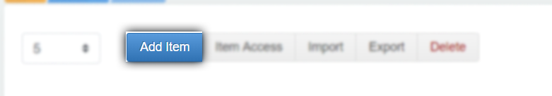
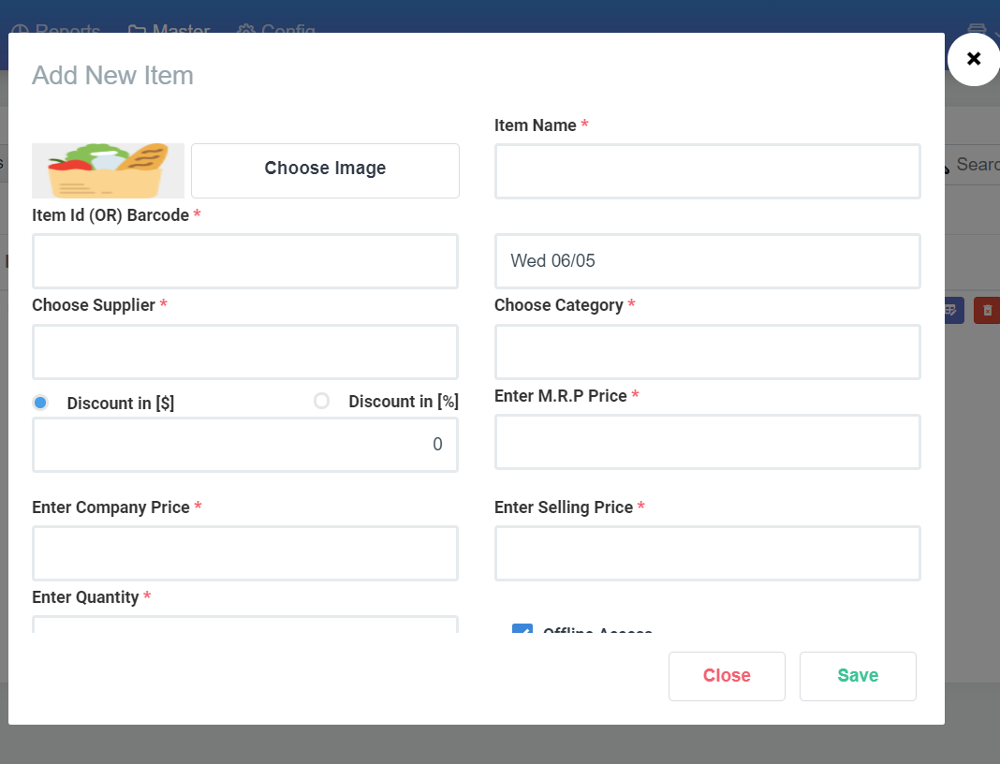
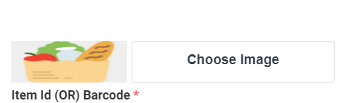
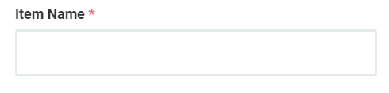
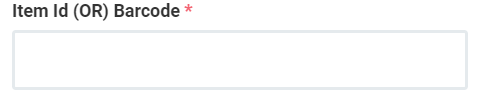

# 4.Add Item

இது ஒரு முக்கிய பகுதி ஏன்னென்றால் நாம் sales செய்யும் பொருட்களை இங்கே add செய்து அதன் விலை நாம் வாங்கிய விலை போன்றவற்றை add செய்து நம்மளுடைய சேல்ஸ் billing பகுதிக்கு Data கொடுக்கும் இடம் இது..

item add செய்ய master ல் item details ஐ click செய்யவும்.

add item screen ல்

1. Add Item
2. Item Access
3. Import
4. Export
5. Delete

button இருக்கிறது மற்றும் Filters & Action உள்ளது.இப்பகுதியில் Action ல் View, Edit, Delete, Item Access தவிர  கூடுதலாக item bar code & item Label   உள்ளது.

item add செய்திட add item button ஐ click செய்யவேண்டும்

popup ல் நாம் sales item ஐ add செய்யலாம்.

popup screen இல் உள்ள ஒவொன்றையும் விரிவாக பார்க்கலாம்.

Add Item ல் உள்ள choose image ல் நாம் add செய்யும் sales item image ஐ upload செய்துகொள்ளலாம்.

item name ல் நாம் விற்பனை செய்யும் பொருளுக்கான name கொடுக்கவேண்டும்.

item Id பகுதியில் நாம் நம்முடைய sales Item க்கு number or name கொடுத்து ஒரு ID கொடுக்க வேண்டும்.

item Supplier பகுதியில் நாம் முன்பு supplier add செய்து இருக்கிறோம் இப்பொது நாம் add செய்யும் sales Item எந்த supplier இடம் இருந்து பெறப்பட்டது என கொடுக்கவேண்டும். நமக்கு அவரின் பெயர் தெரிந்து இருந்தால் name ன் typing அப்பொழுதே sugessstion ல் வரும் இல்லை என்றால் Add + என வரும் Add + ஐ கிளிக் செய்து நாம் supplier ஐ add செய்து நிரப்பலாம்

