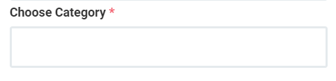
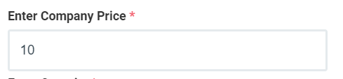
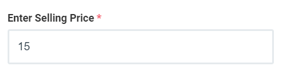
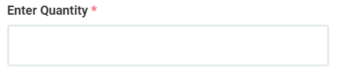

# 4.Add Item

இது ஒரு முக்கிய பகுதி ஏன்னென்றால் நாம் sales செய்யும் பொருட்களை இங்கே add செய்து அதன் விலை நாம் வாங்கிய விலை போன்றவற்றை add செய்து நம்மளுடைய சேல்ஸ் billing பகுதிக்கு Data கொடுக்கும் இடம் இது..

item add செய்ய master ல் item details ஐ click செய்யவும்.

add item screen ல்

1. Add Item
2. Item Access
3. Import
4. Export
5. Delete

button இருக்கிறது மற்றும் Filters & Action உள்ளது.இப்பகுதியில் Action ல் View, Edit, Delete, Item Access தவிர  கூடுதலாக item bar code & item Label   உள்ளது.

item add செய்திட add item button ஐ click செய்யவேண்டும்

popup ல் நாம் sales item ஐ add செய்யலாம்.

popup screen இல் உள்ள ஒவொன்றையும் விரிவாக பார்க்கலாம்.

Add Item ல் உள்ள choose image ல் நாம் add செய்யும் sales item image ஐ upload செய்துகொள்ளலாம்.

item name ல் நாம் விற்பனை செய்யும் பொருளுக்கான name கொடுக்கவேண்டும்.

item Id பகுதியில் நாம் நம்முடைய sales Item க்கு number or name கொடுத்து ஒரு ID கொடுக்க வேண்டும்.

item Supplier பகுதியில் நாம் முன்பு supplier add செய்து இருக்கிறோம் இப்பொது நாம் add செய்யும் sales Item எந்த supplier இடம் இருந்து பெறப்பட்டது என கொடுக்கவேண்டும். நமக்கு அவரின் பெயர் தெரிந்து இருந்தால் name ன் typing அப்பொழுதே sugessstion ல் வரும் இல்லை என்றால் Add + என வரும் Add + ஐ கிளிக் செய்து நாம் supplier ஐ add செய்து நிரப்பலாம்

இதுவும் முன்னரே நாம் category ஐ add செய்து இருக்கிறோம் . நாம் add செய்யும் இந்த sales item எந்த category ல் வருகிறது என இதில் நிரப்ப வேண்டும். category நாம் நிரப்பியதில் இல்லை என்றால் நாம் Add + ஐ click செய்து நிரப்பலாம் .

Item Discount என்பது நாம் Add செய்யும் sales item க்கு ஏதாவது special discount கொடுக்க விரும்பினால் இதில் கொடுக்கலாம். அந்த Item ன் விலையில் % லும் கொடுக்கலாம்.RS லும் கொடுக்கலாம்.குறிப்பிட்ட காலம் மட்டும் என்றால் நம்மிடம் இருக்கும் Edit Option ஐ பயன்படுத்தி மாற்றிக்கொள்ளலாம்

tem MRP என்பது அந்த பொருளின் மீது உள்ள அடக்க விலை நீங்கள் பார்த்து இருக்கக்கூடும் அந்த பொருளின் packet மீது ஒரு விலை Print ல் இருக்கும் .இந்த இடத்தில Sales Item MRP ஐ type செய்ய வேண்டும்.

Item Company Price என்பது நம்முடைய shop க்கு நாம் அந்த Item Purchase செய்ய அன்னதற்கான அடக்க விலை . இங்கே company என்பது நம்முடைய shop ஐ குறிக்கும் . நமக்கு அந்த பொருளுக்கான அடக்க விலையை இந்த பகுதியில் கொடுக்கவேண்டும்.

Item Selling Price என்பது நாம் add செய்யும் இந்த பொருளை எவ்வளவு விலைக்கு விற்பனை செய்யப்போகிறோம் என்பதை கொடுக்கவேண்டும். Selling Price என்பது Company Price க்கும் MRP price க்கும் குறைவில்லாமல் இருக்கவேண்டும்.

Item Quantity என்பது நாம் add செய்யும் item நம்மிடம் எவ்வளவு இருப்பு இருக்கிறது என்பதை குறிக்கிறது.நம்மிடம் இருக்கும் அளவினை இந்த பகுதியில் நிரப்ப வேண்டும் .

Item பற்றிய எல்லா தவல்களும் கொடுக்கப்பட்ட பிறகு save button ஐ click செய்தால் Sales item வெற்றிகரமாக add செய்யப்பட்டுவிடும். இதே முறையை பயன்படுத்தி இன்னும் அதிகமாக பொருட்களை சேர்க்கலாம்.

