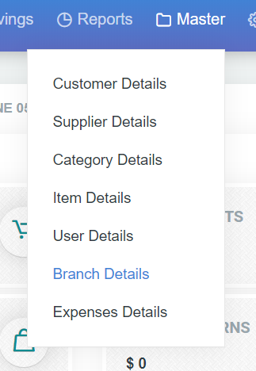
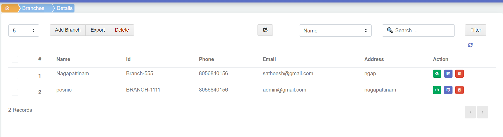
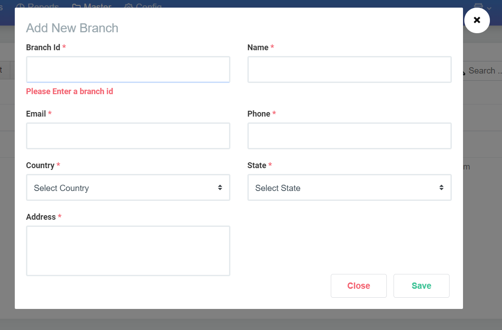

# 6.Branch Details

dashboard ல் master ல் branch details ஐ click செய்வதன் மூலமாக branch add window விற்கு செல்லலாம்

branch add window screen ல்

1. Add Branch
2. Export
3. Delete buttons உள்ளது

மற்றும் Action & Filler வசதி இருக்கிறது.

**1.Add Branch**

branch ஐ add செய்ய Add Branch button ஐ click  செய்யவும்

Add branch icon ஐ click செய்தவுடன் தோன்றிய popup ல் 

1. Branch id 
2. Name
3. Email
4. Phone
5. Country
6. State
7. Address

ஆகிய data கொடுத்து save செய்தால் new Branch Add செய்யப்பட்டுவிடும்.Export , Delete , Filter & Action  ஆகிய option முன்பு நாம் பார்த்ததுபோல உபகோக்கப்படுத்திக்கொள்ளலாம்

