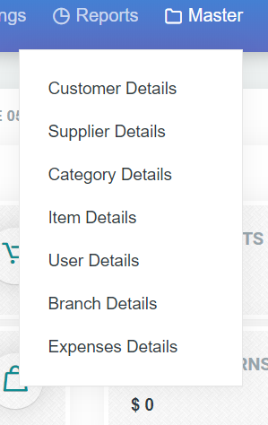
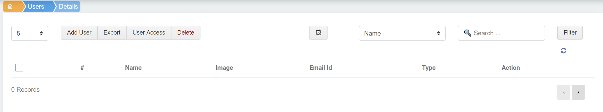
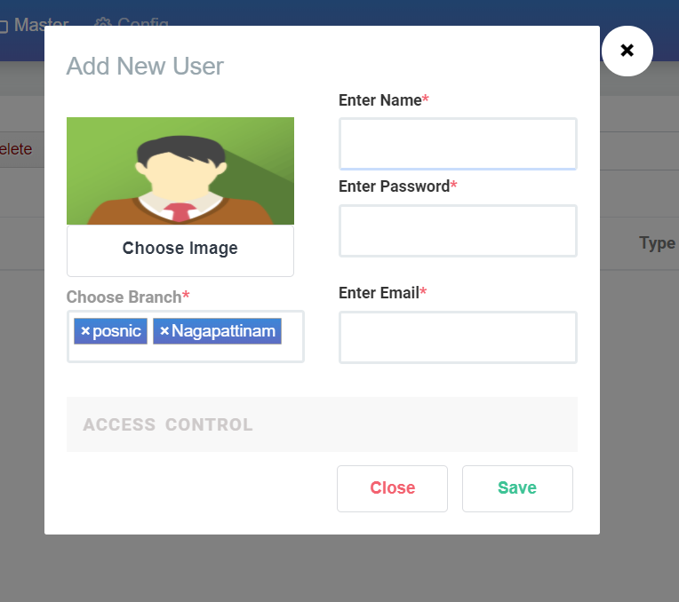
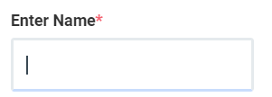
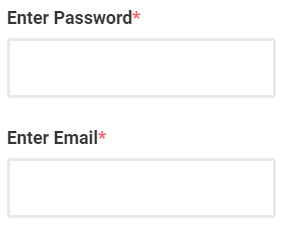
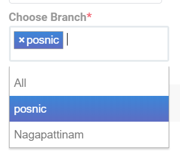
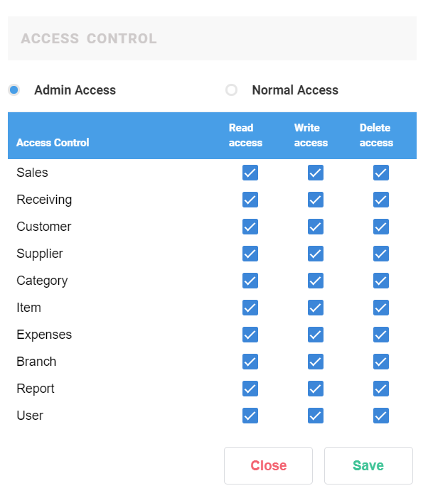

# 5.User Details

User Details என்பது ஒரு shop ல் posnic pro Use செய்யும் பயனாளர்களை குறிக்குறது

User Details ஐ add செய்திட master ல் user details ஐ click செய்யவும்.

தோன்றும் window வில் user details ஐ add செய்யலாம்.

User Details ல்

1. Add User
2. Export 
3. User Access
4. Delete option உள்ளது

மேலும் filters & Action Option ம் இருக்கிறது.

**1.Add User**

ஒரு user ஐ add செய்ய விரும்பினால் Add User Button ஐ Click செய்யவேண்டும்

ஒரு popup window வில் add new user window வில் நம்மால் new user ஐ add செய்யமுடியும்.

**Choose Image**

user image ஐ add செய்ய choose image ஐ Click செய்து upload செய்துகொள்ளலாம்

**Enter Name**

User Name ல் name கொடுக்கவேண்டும்**.**

**Password & Mail id**

Password பகுதியில் password ம் mail id பகுதியில் அவருடைய mail id கொடுக்கப்படவேண்டும்

**User Branch** 

ஒரு shop க்கு branch நிறைய இருந்தால் இந்த user எந்த branch ல் இதை use பன்ன போகிறார் என்று குறிப்பிட வேண்டும்.branch details ல் எப்படி ஒரு branch add செய்வது என link ஐ கிளிக் செய்து பார்க்கலாம்**.**

**User Access**

**\]**user access என்பது மிக முக்கியமானது ஏன்னென்றால் இந்த user எந்த எந்த option ஐ எவ்வளவு பயன்படுத்தலாம் என கட்டுப்படுத்த மிகவும் உதவிடும். Read , Wright , Delete ஆகியவை மூலமாக control செய்ய முடியும் . user access select செய்த பிறகு save button ஐ click செய்தால் வெற்றிகரமாக user add முடிவுபெற்று இருக்கும்

