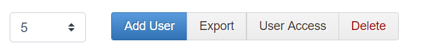

# 5.User Details

User Details என்பது ஒரு shop ல் posnic pro Use செய்யும் பயனாளர்களை குறிக்குறது

User Details ஐ add செய்திட master ல் user details ஐ click செய்யவும்.

தோன்றும் window வில் user details ஐ add செய்யலாம்.

User Details ல்

1. Add User
2. Export 
3. User Access
4. Delete option உள்ளது

மேலும் filters & Action Option ம் இருக்கிறது.

**1.Add User**

ஒரு user ஐ add செய்ய விரும்பினால் Add User Button ஐ Click செய்யவேண்டும்

ஒரு popup window வில் add new user window வில் நம்மால் new user ஐ add செய்யமுடியும்.

**Choose Image**

user image ஐ add செய்ய choose image ஐ Click செய்து upload செய்துகொள்ளலாம்

