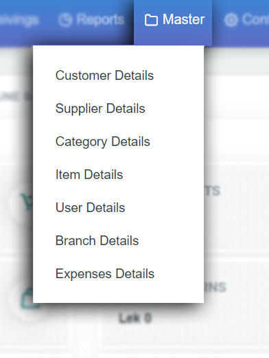

# Master

இப்போது dashboard இல் இருக்கும் master பகுதி மிக முக்கியமாக பகுதி .இந்த பகுதி இல் 

* 1. customer details 
* 2. supplier details 
* 3. category details 
* 4.item details 
* 5.user details 
* 6.branch details 
* 7.Expense details இருக்கிறது 

இந்த பகுதி இல் நாம் purchase பண்ணும் பொருட்களை sales க்கு add செய்யும் process நடக்கிறது. இதில் customer முதல் supplier item அது எந்த வகை என்ற details ம் employee ,branch , branch expense ம் பதிவேற்றம் செய்யவேண்டும்

