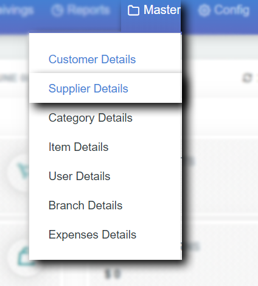
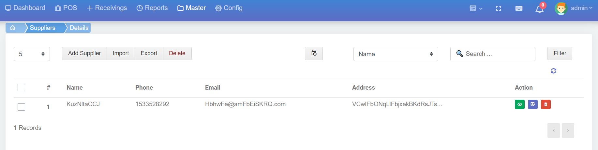
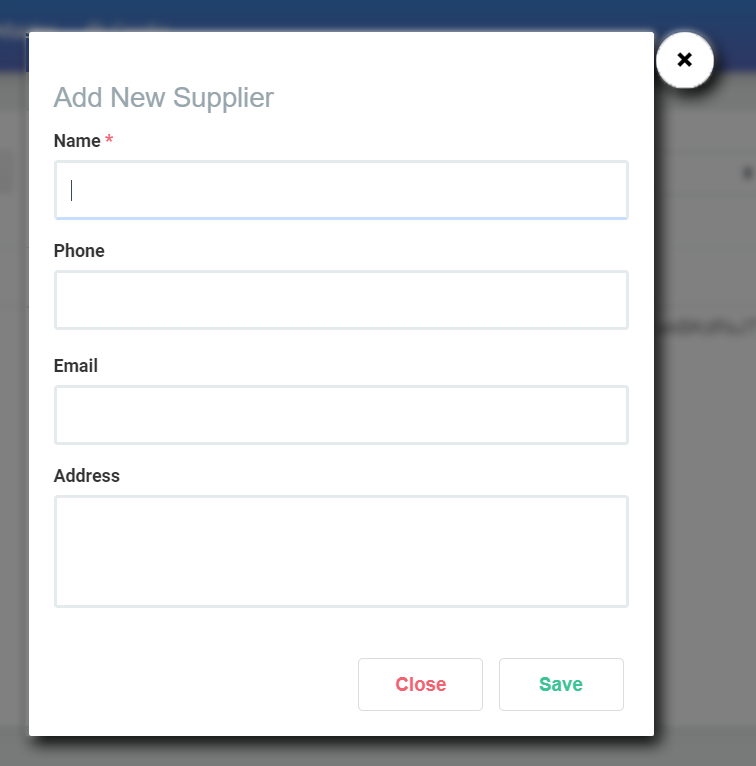
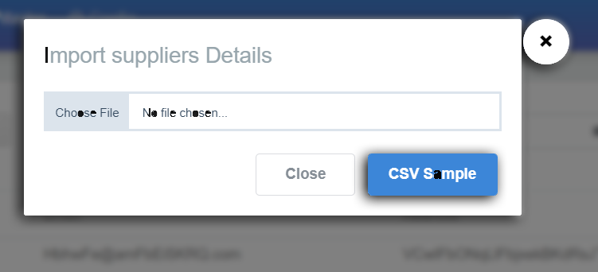
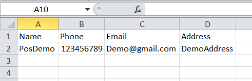
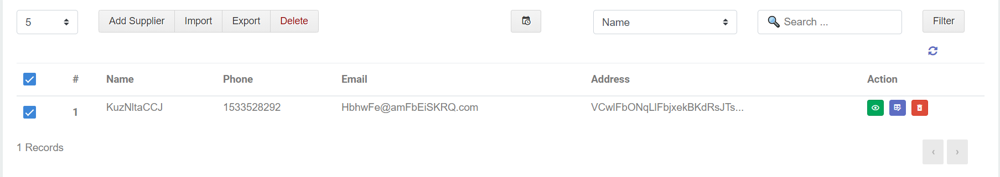
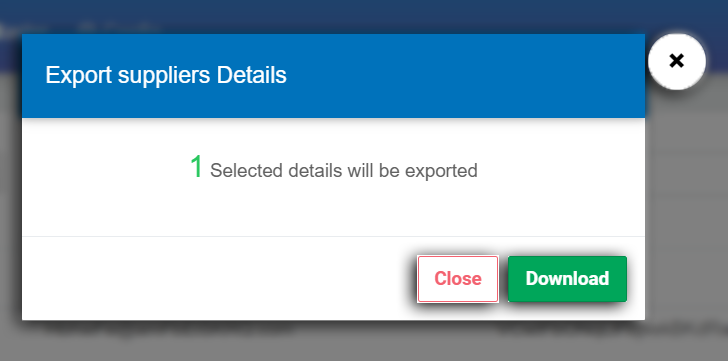

# 2.Supplier details

Supplier details இது நாம் shop ற்கு பொருட்களை மற்ற இடங்களில் இருந்து விற்பனைக்கு கொடுவாருவோம் நாம் யாரிடம் இருந்து அந்த பொருட்களை பெருகிறோமோ அவர்தான் நமக்கு supplier அவருடைய details ஐ எப்படி add செய்வது என்பதை இந்த பகுதில் விரிவாக பார்க்கப்போகிறோம்

நாம் Supplier details add செய்திட master ல் சென்று Supplier details ஐ select செய்தால் Supplier details page நமக்கு திரையில் தோன்றும்.

Supplier details திரையில்

1. Add Supplier 
2. Import
3. Export
4. Delete        

மற்றும்

Fillers & Action ம் உள்ளது இதன் பயன்பாடுகளை காண்போம்

**1.Add Supplier**

Supplier details ஐ add button ஐ click செய்யவேண்டும்.

Supplier details ஐ add button ஐ click செய்த உடன் ஒரு pop up window நமக்கு open ஆகிறது . இதில் தான் நாம் Supplier details ஐ கொடுத்து save செய்துகொள்ள போகிறோம்

Supplier details ல் நாம் Supplier ன் **Name, Phone, Email, Address** போன்ற details ஐ கொடுத்து save செய்துகொள்ளலாம்

**2. Supplier Import** 

நம்மிடம் ஏற்கனவே இருக்கும் supplier details ஐ இந்த Import option வழியாக ஏற்றிக்கொள்ளலாம்.அதற்கு Import Button ஐ click செய்தால் ஒரு pop up உதவுகிறது.

import செய்ய முதலில் popup ல் உள்ள sample csv ஐ click செய்து download ஆகும் csv file ஐ open செய்து பார்க்கவும் .posnic pro supplier csv file format உடன் நீங்கள் import செய்ய விரும்பும் format சரியாக இருக்கவேன்டும் .சரியாக இருக்கிறதா என பார்த்து உங்களுடைய file ஐ choose செய்து import செய்துகொள்ளலாம் .

**3. Supplier Export**

\*\*\*\*

உங்களிடம் உள்ள supplier details ஐ download செய்ய இந்த export option பயன்படுகிறது

உங்களுக்கு எந்த எந்த supplier details வேண்டுமோ அதனை select செய்து export button ஐ click செய்தால் நாம் எவ்வளவு select செய்து இருக்கிறோம் என்று ஒரு popup தோன்றி உறுதி படுத்தும் .

popup ல் download button ஐ click செய்தால் நமக்கு supplier details ஐ download ஆகிறது.

**Fillers** 

இங்கே Filters என்பது customer details ல் நாம் பார்த்த filters போலவே தான் ..மீண்டும் அந்த fillers பகுதிக்கு செல்ல [இங்கே click செய்யவும்](1.customer-details.md#filters)

