# New Sales

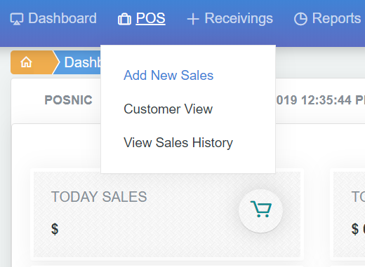

நம்முடைய Posnic Pro வில் sales bill பகுதிக்கு செல்ல dash board இல் pos click செய்து அதில் add sales ஐ கிளிக் செய்யவும்.

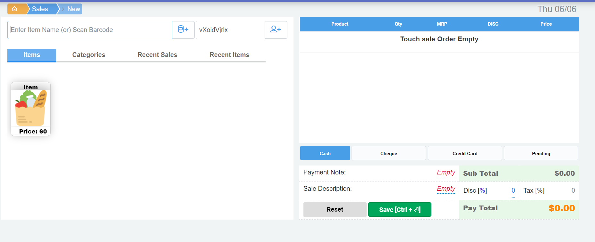

Sales page இல் நாம் விற்பனைக்கு சேர்க்கப்பட்ட அணைத்து item ம் இருக்கும். நீங்கள் bar code scanner வழியாகவும் சுலபமாக sales item ஐ உள்ளீடாக கொடுக்க முடியும் இல்லை என்றால் mouse அல்லது keyboard வழியாகவும் உங்கள் screen ல் touch option இருந்தால் அதன் வழிகவும் sales item ஐ select செய்ய முடியும்

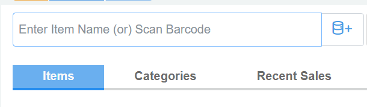

இந்த இடத்தில் நாம் sales item ஐ type செய்துகொள்ளலாம். அல்லது bar code scanner use செய்துகொள்ளலாம்

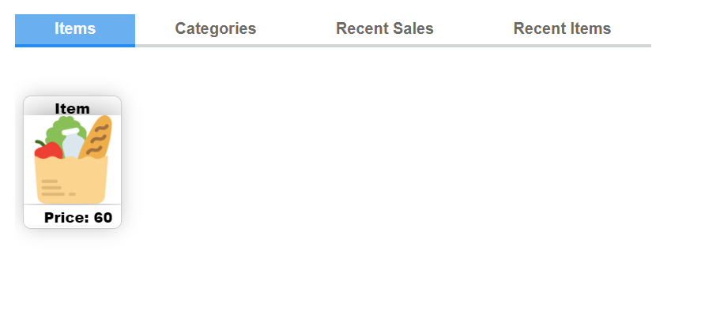

மேலே இருப்பது touch screen option உங்கள் screen ல் இருந்தால் இதன் மூலமாக touch செய்து sales item ஐ add செய்ய முடியும். இதில் இருப்பது sales item களை ஒவ்வொன்றாக item wise வரிசைப்படுத்தி நமக்கு தெரிவிக்கிறது.

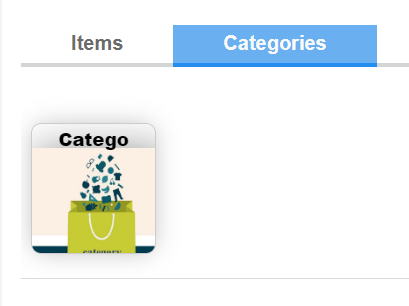

மேலே இருப்பது touch screen option உங்கள் screen ல் இருந்தால் இதன் மூலமாக touch செய்து sales item ஐ add செய்ய முடியும். இதில் இருப்பது sales item களை ஒவ்வொன்றாக Category wise வரிசைப்படுத்தி நமக்கு தெரிவிக்கிறது.

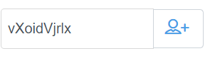

மேலே இருப்பது யாருடைய name ல் bill கொடுக்கிறோம் என்பதை சொல்ல நாம் customer add ல் add செய்த customer ஐ இங்கே type செய்து செலெக்ட் செய்துகொள்ளலாம். இல்லை என்றால் நாம் confic ல் default customer வைத்தோம் அல்லவா அவர் பெயரிலேயே இருக்கும்.

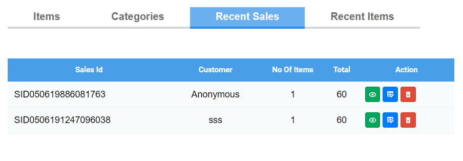

மேலே இருப்பது கடைசியா போடப்பட்ட bill என்ன என்ன என்பதை சுலபமாக பார்க்க recent sale உதவுகிறது இதில் உள்ள action வழியாக நாம் bill ஐ பார்க்கலாம் edit செய்யலாம் , print செய்துகொள்ள உதவுகிறது.

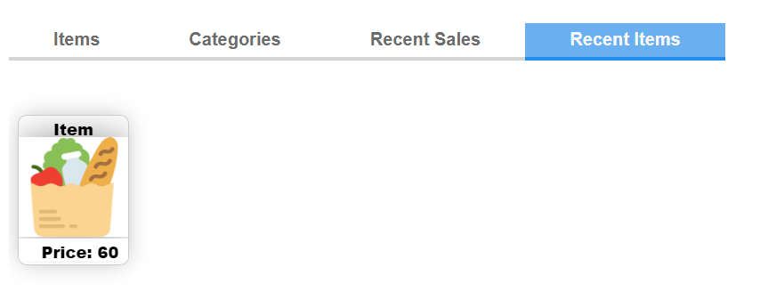

மேலே இருப்பது கடைசியா எந்த எந்த item sales ஆனது என்று சுலபமாக பார்ப்பதற்கு வழிவகை செய்கிறது

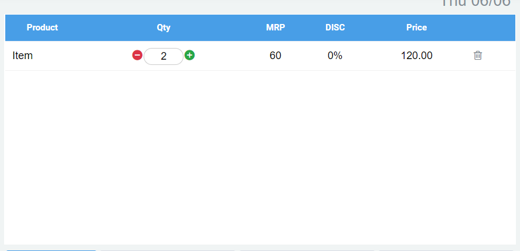

மேலே இருப்பது நாம் பில்லிற்கு entry செய்யும் item ன் product name , எவ்வளவு பொருட்கள்  quantity\(Qty\), பொருட்கள் விலை MRP, தள்ளுபடி இருந்தால் அதன் விவரம் Discount\(Dis\), மொத்தவிலை Price   ஆகியவற்றை தெரிவிக்கிறது. இதில் Qty இன் அளவை **\( + & - \)** குறிகளை உபயோகித்து மாற்றம் செய்ய முடியும்

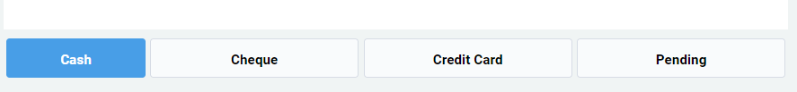

இப்போது ஒருவர் வாங்கிய பொருட்களை Bill ல் Add செய்துவிட்டோம் . அவர் அதற்கான பணத்தை எந்த வழியில் கொடுக்கிறார் எனபதை இதில் select செய்துகொள்ளலாம். cash என்றால் ரொக்கமாக தருகிறார் என்று பொருள்கொள்ள வேண்டும் .

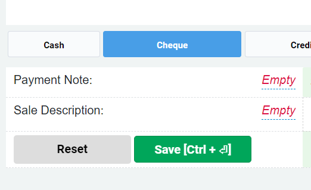

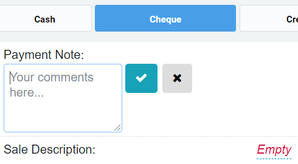

இப்போது ஒருவர் cheque கொடுக்கிறார் என்றால் அதனை Cheque என குறித்து payment note ல் அந்த cheque க்கான detalis ஐ குறித்து கொள்ளலாம். note செய்து அதனை wright icon ஐ click செய்து சேமிக்க வேண்டும்.

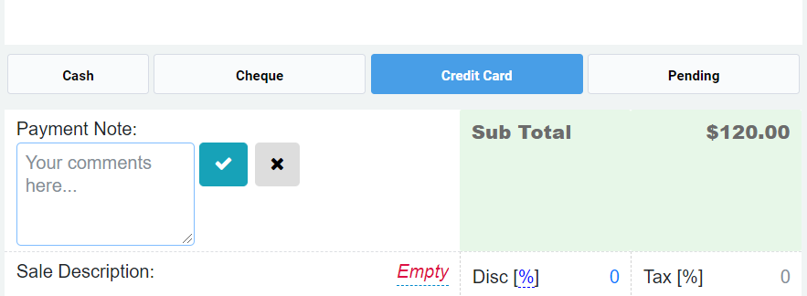

இப்போது ஒருவர் Credit Card அல்லது Debit கார்டு கொடுக்கிறார் என்றால் அதனை Credit Card என குறித்து Card Swiping செய்துகொள்ளலாம்.

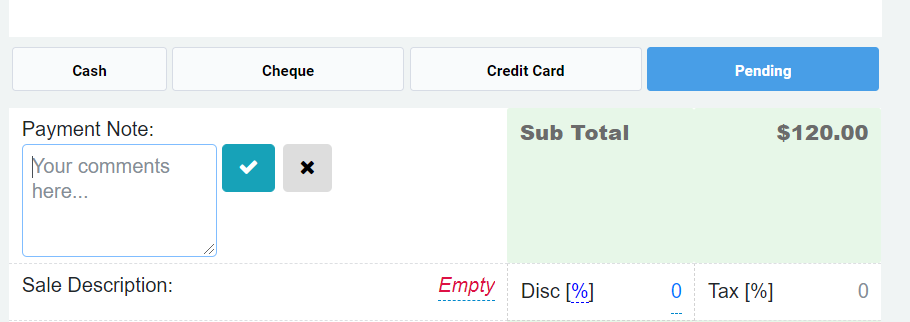

இப்போது ஒருவர் கடனாக பொருட்களை வாங்குகிறார் என்றால் அதனை pending ஐ select செய்து Bill போடலாம். Pending ஐ பில் போடும் பொழுது Customer details சரியாக இருக்கிறதா என நோட் செய்வது அவசியம்.

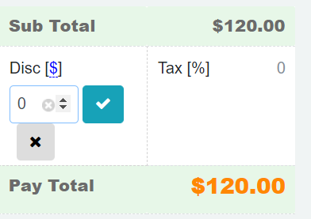

மேலே இருப்பது நாம் பில்லிற்கு entry செய்யும் item ன் மொத்த பில் ன் தொகை . இதில் discount கொடுக்க விரும்பினால் discount பக்கத்தில் இருக்கும் ஐகான் ஐ கிளிக் செய்து discount in % அல்லது discount in RS என செலெக்ட் செய்து Discount கொடுக்கலாம் . இது Bill ன் மொத்த தொகைக்கான Discount ஐ வழங்கிவிடும்.

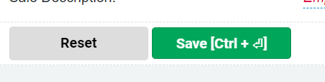

Bill மொத்தமாக முடிந்த பிறகு save அல்லது CTRL + Enter key ஐ keborad ல் அழுத்துவதன் மூலம் bill ஐ save செய்துகொள்ள முடியும்.bill வேண்டாம் என்றால் reset button ஐ click செய்து வெளியில் வரலாம்.Save செய்த உடனே print க்கு செல்லவேணுமானால் நாம் confic ல் &gt; common setting ல் &gt; Auto Print After Sales option ஐ முன்னரே கிளிக் செய்து வைத்து இருக்க வேண்டும். இல்லையென்றால் recent bill ல் சென்று action உதவியுடன்.Print செய்துகொள்ளலாம்.

