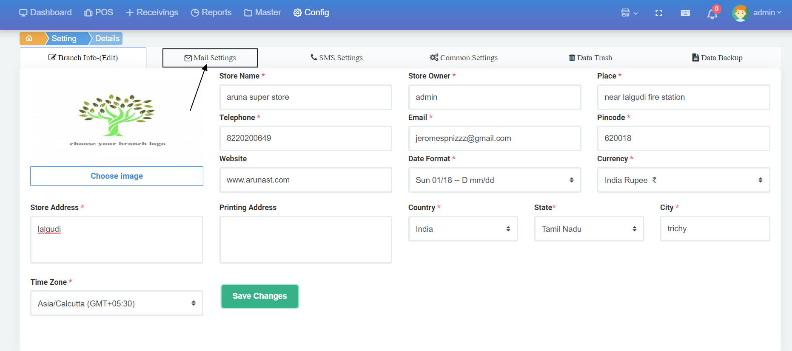
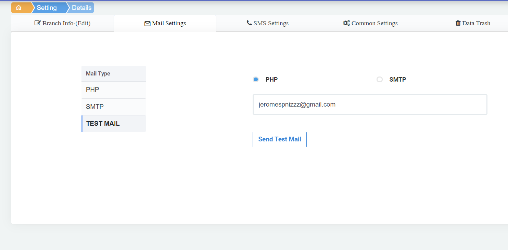
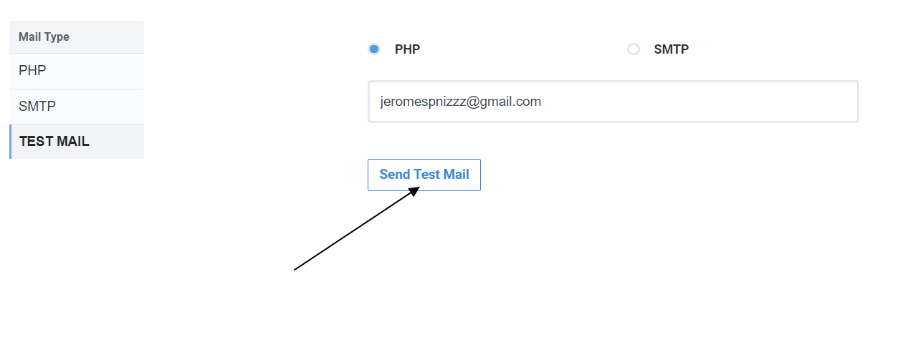

# 2.Mail Settings

Mail Settings ஐ click செய்யவும்

இதில் email id \(நமக்கு எந்த mail id கு bill details வர வேண்டுமோ அந்த மெயில் id ஐ config செய்துகொள்ளலாம்

config செய்த mail id சரியாக work ஆகிறதா என்பதை உறுதி செய்ய send test mail button ஐ click செய்யவும்

