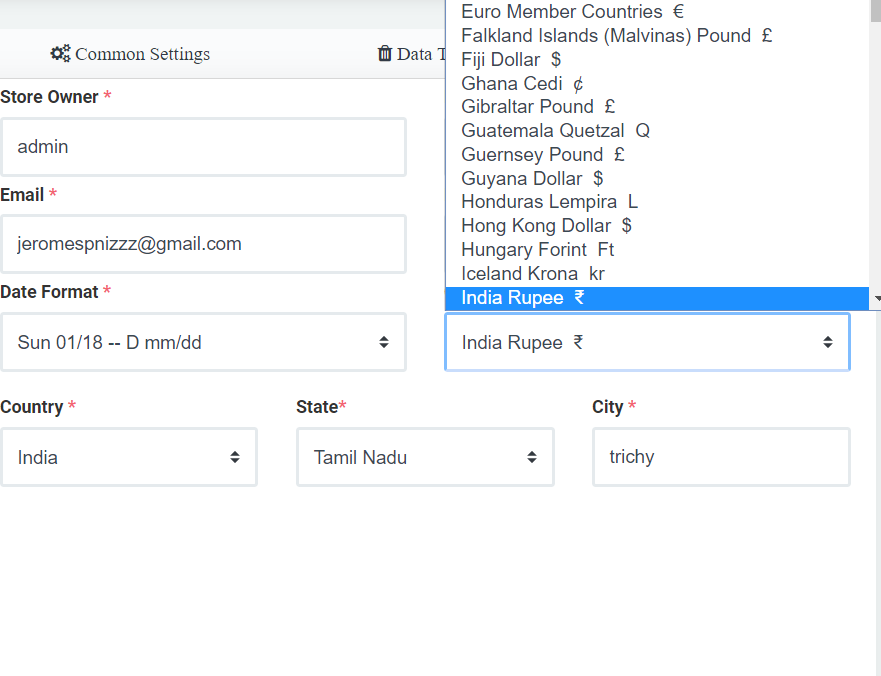

# 1.Branch info

Branch info window வில் Chose Logo என இருக்கும் இடத்தில் company logo வை upload செய்துகொள்ளலாம்

Branch info window வில் Store Name , Store owner, Place \(Store இருக்கும் பகுதி \), Telephone or Mobile Number , Email முகவரி , Pin code ஆகியவைகளை சரியாக கொடுக்கவும் , இவை அனைத்தும் முக்கியமாக கொடுக்கவேண்டிய பகுதிகள்... சிகப்பு star உள்ள அணைத்து பகுதிகளையும் fill செய்ய வேண்டியது அவசியம் ... 

இதில் **date Format,  currency, country, sate, city, time zone**  ஆகியவை drop down list Select option இல் உள்ளது .தேவையவற்றை select செய்து save செய்துகொள்ளவும்

